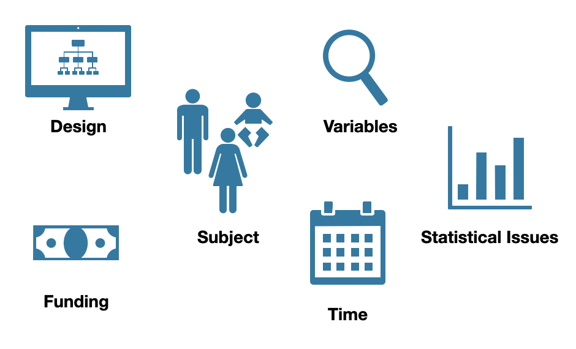

# Clinical Trials: Phase Completion Prediciton

Erdös Institute Project 
Members: 

  - Adriana Morales Miranda 
  - Meghan Peltier
  - Devashi Gulati 

## Project Summary 

Clinical trials are the backbone of drug development and diagnostic methods. Clinical trials are essential because they inform researchers about diseases and treatments in a way that cannot be learned in the laboratory.

Clinical trials are also resource intensive - they are expensive, time consuming and require trained workers. They are often burdensome on patients. They have multiple phases which can last months. The investments of resources, time, and funding grow with successive stages, from pre-clinical through phase 3. Thus, the cost of a failed phase 3 trial is not just the cost associated with the trial itself but the cost of all prior trials as well as the opportunity cost of lost time pursuing a potentially viable alternative. Focusing on phase 3 trials, the Pharmaceutical Research and Manufacturers of America estimated the cost at $42,000 per patient in 2013, with $10 billion spent on 1680 phase 3 clinical trials comprising over 600,000 patients.

The purpose of our project was to analyze clinical trial data and determine the most important features contributing to clinical trial phase failure. After modeling the data from NIH U.S National Library of Medicine’s website - https://clinicaltrials.gov/, we concluded that the enrollment fraction i.e.  the actual enrollment divided by the desired enrollment is the major predictor for successful completion of clinical trials. Our logisticnregression model, if implemented, would save 24% of the money spend.

It is not the length of the trial, nor how invasive the trial is, or which age group it targets which make a difference. So clinical trials should not be given undue priority on the basis of these factors. Instead, there should be an increased effort to increase enrollment. This could be via increased marketing, more monetary and non-monetary incentives for the participants, decreased wait times, etc to name a few factors. 

The National Institutes of Health (NIH) invests about $41.7 billion annually in medical research. More than 80 percent of NIH’s funding is awarded for extramural research, largely through almost 50,000 competitive grants to more than 300,000 researchers at more than 2,500 universities, medical schools, and other research institutions in every state. Using our logistic prediction model, NIH could save 24% of the 30 billion it spends on clinical trials i.e approximately 7.2 billion dollars of taxpayer money. 

We suggest that data related to factors which could influence the enrollment factor of a clinical trial be recorded so as to facilitate a deeper analysis into how to increase enrollment and predict successful completion. This could save the NIH and the pharmaceutical companies billions of dollars. 

## Notebook Descriptions

### ExtractingFromWebpage.ipynb

In this notebook we use web extrating techniques to ge information from the ClinicalTrials.gov website. The website itself allows us to download .csv files which contain most of the information we require for our analysis. Nevertheless, there are some columns we want to have that are not as easily available.

There are 30,000 webpages that we want to web scrape, below is a code for automated web scraping that speeds up our data collection process. We use this code to scrape :

  - NCT Number (so that we can match it to the .csv files
  - Desired enrollment
  - Countires were the trial was conducted

**Note:** If you have the NCT Number for a clinical trial you want to extract information from, you can use this code to do so.

### Data_Preparation.ipynb

In this notebook we clean and pre-proccess our data for analysis. 

### Exploratory_Data_Analysis.ipynb

In this notebook we use descriptive statistical techniques to analyze the correlation between data features and the status of a trial as completed or terminated.

### Model_All_Data.ipynb 

In this notebook we implement three differents modeling tools for classification problems:

  - Logistic Regression
  - Random Forests
  - Artifical Neural Networks (ANN)

**Goal:** We want to identify if the phase of a clinial trial will be completed or terminated based on different factors like:

  - Enrollment fraction: (actual number of people enrolled)/(desired number of people)
  - Phase of the trial
  - Age type of people enrolled in trial phase
  - Genders allowed in trial phase
  - Intervention method of the trial phase
  - Number of months between start and end of phase
  - Actual number of people enrolled
  - Estimated or desired number of people per trial

The goal is to see how well these three different models perform on our data and extract important information.

## Results 

### Logistic Regression Model

The first model we implemented is a  logistic regression model, which is a classic  way to perform binary classification. In simple terms, it's a generalized model that predicts the probability that an event will occur. 

We can see that the enrollment fraction is very important for predicting completion of a trial, which matches with the results from our data exploration. The desired amount of people enrolled is also considered an important feature. We can also see that the actual amount of people enrolled affects the model negatively, which makes sense with respect to the literature, the less people in a trial the more difficult it is to complete it. Months, age type, phases, gender, and intervention have been marked as unimportant by the model.
 
This model has an accuracy score of 83% on the test data. This seems pretty impressive, but remember that accuracy is not a great measure of classifier performance when the classes are imbalanced, we can see this from the precision, recall, and f1-score . We can see that our model has a 96% precision rate for trial completion and a 43% precision rate for termination. This is no doubt a result of our data imbalance. 

### Random Forest Model

We also decided to look at a random forest model. It is called a “forest” because it grows a forest of decision trees. The data from these trees are then merged together to ensure the most accurate predictions. We can see that the enrollment fraction is still very important for predicting completion of a trial. The random forest also considers the actual value of enrolled people as an important feature. This model has an accuracy score of 90% on the test data, which is slightly better than the Logistic Model. While the completed trials are very well predicted it's not as good for the terminated trials with very low overall metrics, again very similar to the Logistic Model. 

### Neural Network Model

Next, we implemented a neural network. In simple terms, the network acts like our brains by recognizing patterns. It processes 'inputs' from the outside world, categorizes them using mathematical layers, and then generates an 'output', which in our case is terminated or completed. This model has an accuracy score of 90% on the test data, which is very close to the Random Forest model. But this model is still not good enough if we look at the recall and f1-score for the terminated trials. 

